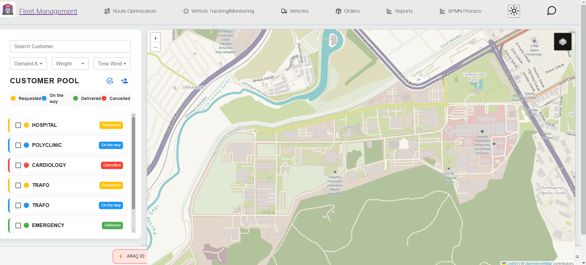

# Fleet Management Application

Bu uygulama OPEVA ve SUIT projesi kapsamında bir filo yöneticisinin gözünden filo yönetimini kolaylaştırmak amacıyla geliştirilmiştir. Uygulama, filo yöneticisinin filosundaki araçları, araçların bakım ve onarım durumlarını, araçların konumlarını ve araçların sürücülerini takip etmesine olanak sağlar. Ayrıca filo yöneticisi, araçların bakım ve onarım durumlarını, araçların konumlarını ve araçların sürücülerini düzenleyebilir.


## Kullanılan Teknolojiler
- React
- Node.js
- Leaflet.js
- Material-UI

## Gereksinimler

- 

  
## Kurulum
Projeyi klonlayın
```bash
  git clone
```
Proje dizinine gidin
```bash
  cd my-project
```
Gerekli paketleri yükleyin
```bash
  npm install
```
Uygulamayı başlatın
```bash
  npm start
```
## Ekran Görüntüleri




